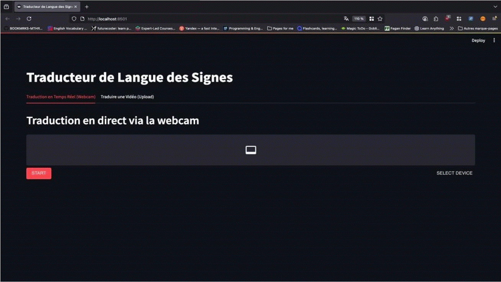

# Real-Time-Moroccan-Sign-Language-Translator
# Real-Time-Moroccan-Sign-Language-Translator
<!-- ############################################################### -->
<!-- #               README.md dyal projet professional            # -->
<!-- # Copier-coller hadchi kaml f fichier README.md dyalk          # -->
<!-- # W bdel l'hajat li bin had les commentaires                 # -->
<!-- ############################################################### -->

# 🇲🇦 Traducteur de Langue des Signes Marocaine (LSM) en Temps Réel

<!-- BDEL HAD LES BADGES B SMIYA DYAL L'REPO W L'USERNAME DYALK F GITHUB -->


<!-- L'KHOTWA L'MOHIMA BZAF: Mli tssali l'projet, sn3 GIF zwin dyal l'application khdama
     b ScreenToGif (f Windows) wlla Giphy Capture (f Mac), w 7eto f l'dossier dyal l'projet.
     Bdel "demo.gif" ltaht b smiya dyal l'fichier dyalk. Hada howa li ghaybiyen 9owa dyal l'projet. -->
<p align="center">
   <br>
     
</p>

Ce projet est une application d'Intelligence Artificielle capable de reconnaître et de traduire la **Langue des Signes Marocaine (LSM)** en texte, en temps réel, en utilisant la caméra d'un ordinateur. L'objectif est de faciliter la communication entre la communauté des sourds et muets et le grand public.

_This project is an AI-powered application that recognizes and translates **Moroccan Sign Language (MSL)** into text in real-time, using a standard computer camera. The goal is to bridge the communication gap between the deaf and mute community and the general public._

---

## ✨ Fonctionnalités / Features

*   **Traduction en Temps Réel :** Analyse le flux vidéo de la caméra et affiche la traduction instantanément.
*   **Haute Précision :** Utilise un modèle de Deep Learning moderne (CNN + LSTM) pour une reconnaissance robuste des gestes.
*   **Architecture Modulaire :** Le code est organisé de manière professionnelle, séparant la préparation des données, l'entraînement et l'inférence.
*   **Interface Intuitive :** Une interface utilisateur simple construite avec Streamlit pour une utilisation facile.
*   **Extensible :** Conçu pour pouvoir ajouter facilement de nouveaux gestes et mots au vocabulaire.

---

## 🛠️ Stack Technique / Built With

Ce projet a été réalisé en utilisant les technologies suivantes :

*   **Framework IA :** [PyTorch](https://pytorch.org/)
*   **Vision par Ordinateur :** [OpenCV](https://opencv.org/), [MediaPipe](https://google.github.io/mediapipe/)
*   **Interface Utilisateur :** [Streamlit](https://streamlit.io/)
*   **Manipulation de Données :** [NumPy](https://numpy.org/)
*   **Analyse de Performance :** [Scikit-learn](https://scikit-learn.org/), [Matplotlib](https://matplotlib.org/)

---

## 🚀 Démarrage / Getting Started

Suivez ces étapes pour installer et lancer le projet sur votre machine.

### Prérequis / Prerequisites

*   Avoir [Git](https://git-scm.com/) installé.
*   Avoir [Miniconda](https://docs.conda.io/en/latest/miniconda.html) ou Anaconda installé.
*   Un dataset de vidéos de la LSM, organisé en sous-dossiers par mot (ex: `.../clavier/video1.mp4`).

### Installation & Configuration

1.  **Cloner le repository GitHub :**
    ```bash
    git clone https://github.com/votre-username/votre-repo-name.git
    cd votre-repo-name
    ```
    <!-- BDEL 'votre-username' w 'votre-repo-name' -->

2.  **Créer un environnement Conda :**
    ```bash
    conda create --name lsm_env python=3.9
    conda activate lsm_env
    ```

3.  **Installer les dépendances :**
    ```bash
    pip install torch torchvision torchaudio
    pip install -r requirements.txt
    ```
    _Note : Vous devez d'abord créer un fichier `requirements.txt` contenant les autres dépendances comme `opencv-python`, `mediapipe`, `streamlit`, etc._

---

## 📖 Utilisation / Usage

Le projet est divisé en 3 étapes principales.

### 1. Préparation des Données

Placez vos vidéos dans le dossier `data/raw_videos/`, organisées par geste. Ensuite, exécutez les scripts de pré-traitement.

```bash
# Choisir votre environnement (local/cloud) dans les scripts d'abord
python src/01_preprocess.py
python src/02_normalize.py
